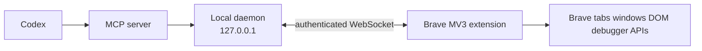

# brave-mcp


`brave-mcp` is a full local-control stack that lets Codex operate the Brave browser through MCP.

It is built as three cooperating pieces:

- a Brave-compatible MV3 extension
- a localhost daemon that owns pairing, routing, and runtime state
- an MCP server that Codex can register locally

The goal is not just "browser automation", but a shareable browser control product with a clean install story, clear security boundaries, and a stable tool contract.

## What This Project Does

With `brave-mcp`, Codex can:

- inspect and switch tabs and windows
- navigate pages and wait for page state changes
- query DOM state and visible text
- click, type, scroll, drag, upload files, and press keys
- capture screenshots, PDFs, console logs, cookies, and network traces
- apply page-scoped overrides like user agent and media emulation
- intercept requests, mock responses, throttle network, and export session state

This repo contains both the implementation and the machine-readable contracts for that tool surface.

## Demo Shape

The intended interaction model is simple:

1. Codex calls an MCP tool such as `open_tab`, `query_selector`, or `capture_screenshot`
2. the MCP server validates and forwards the request to the local daemon
3. the daemon routes it to the paired Brave extension
4. the extension performs the browser action and returns a typed result

Example daemon RPC:

```json
{
  "id": "req_123",
  "method": "tabs.navigate",
  "params": {
    "tabId": 401,
    "url": "https://example.com",
    "waitUntil": "load",
    "timeoutMs": 15000
  },
  "authToken": "redacted"
}
```

Example result:

```json
{
  "id": "req_123",
  "ok": true,
  "result": {
    "url": "https://example.com/",
    "status": "ok"
  }
}
```

## Why The Architecture Looks Like This

The project uses a three-layer design on purpose.

### 1. Extension

The extension is the only part that talks directly to Brave browser APIs and page DOM.

It handles:

- tabs and windows APIs
- DOM interaction through injected scripts
- screenshots, downloads, debugger-backed network hooks, and other browser features
- user-visible pairing and health UI

### 2. Daemon

The daemon is a localhost-only control plane between Codex and the browser.

It handles:

- pairing secret generation and verification
- extension connection lifecycle
- request routing and timeouts
- health endpoints
- stable RPC semantics regardless of how the extension transport evolves

### 3. MCP Server

The MCP server is the Codex-facing layer.

It handles:

- MCP tool registration
- input validation
- mapping tool calls onto daemon RPC methods
- clean error normalization for Codex

This separation matters because it keeps the MCP layer stable while browser-specific logic stays isolated in the extension and daemon.

## Architecture



More detail is in [docs/architecture.md](docs/architecture.md).

## Current Status

The stack is implemented and working as a local development system.

Current public contract:

- version: `0.11.0`
- tool count: `48`
- daemon transport: localhost HTTP + WebSocket bridge
- Codex transport: local MCP server over `stdio`

The current machine-readable contracts live here:

- [Tool catalog](specs/tools/brave-tools.schema.json)
- [Daemon RPC schema](specs/rpc/daemon-rpc.schema.json)

The architectural design document lives here:

- [Implementation blueprint](docs/implementation-blueprint.md)

The evolving delivery checklist lives here:

- [Tool implementation checklist](docs/tool-implementation-checklist.md)

Supporting docs:

- [Architecture notes](docs/architecture.md)
- [Local install and smoke test guide](docs/local-install.md)
- [Contributing guide](CONTRIBUTING.md)

## Tool Coverage

The implemented tools are grouped roughly like this.

### Browser And Window Control

- `list_tabs`
- `list_windows`
- `get_active_tab`
- `get_tab_info`
- `get_window_info`
- `open_tab`
- `new_window`
- `close_tab`
- `close_window`
- `switch_to_tab`
- `focus_tab`
- `set_viewport`

### Navigation

- `navigate`
- `reload_tab`
- `back`
- `forward`
- `wait_for_navigation`
- `wait_for_idle`

### DOM Discovery And Read Operations

- `query_selector`
- `query_elements`
- `wait_for_selector`
- `get_visible_text`
- `get_dom`
- `elements_from_point`

### Interaction

- `click`
- `hover`
- `type_text`
- `select_option`
- `press_key`
- `scroll_to`
- `drag_and_drop`
- `upload_file`

### Capture And Diagnostics

- `capture_screenshot`
- `capture_pdf`
- `get_console_logs`
- `download_asset`
- `execute_javascript`
- `network_log`
- `cookie_access`
- `session_export`
- `har_export`

### Traffic And Storage Control

- `request_intercept`
- `mock_response`
- `throttle_network`
- `clear_storage`
- `grant_permissions`

### Emulation

- `set_user_agent`
- `emulate_media`

`geolocation_override` was prototyped but intentionally removed from the public tool list because it was not reliable enough in Brave to keep in the supported surface.

## Security Model

This project is intentionally local-first and explicit about authority.

- The daemon binds to `127.0.0.1` only.
- The extension authenticates with a per-user secret.
- MCP never talks directly to the browser; it talks to the daemon.
- Browser-mutating tools are explicit and typed.
- The extension only works after pairing.
- The daemon can report health and pairing state without exposing browser content.

This is not meant to be an invisible headless browser farm. The browser is user-visible and the control channel is local.

## Repository Layout

```text
.
├── apps
│   ├── daemon      # localhost bridge and RPC service
│   ├── extension   # Brave-compatible MV3 extension
│   └── mcp         # Codex-facing MCP server
├── docs
│   ├── implementation-blueprint.md
│   └── tool-implementation-checklist.md
├── install         # installer placeholders and packaging notes
├── packages
│   ├── protocol    # shared schemas and contracts
│   └── sdk         # test/simulation helpers
└── specs
    ├── rpc
    └── tools
```

Package-level notes:

- [apps/extension/README.md](apps/extension/README.md)
- [apps/daemon/README.md](apps/daemon/README.md)
- [apps/mcp/README.md](apps/mcp/README.md)
- [packages/protocol/README.md](packages/protocol/README.md)
- [packages/sdk/README.md](packages/sdk/README.md)
- [install/README.md](install/README.md)

## Local Development Quick Start

### Prerequisites

- Node `22+`
- npm or pnpm
- Brave browser
- Codex CLI with MCP support

### Build Everything

```sh
npm run build:protocol
npm run build:sdk
npm run build:daemon
npm run build:extension
npm run build:mcp
```

### Start The Daemon

```sh
node apps/daemon/dist/index.js --port 39200 --config-dir /tmp/brave-mcp-smoke
```

Or let the repo launch the local stack for you:

```sh
npm run launch:brave
```

The daemon writes its pairing secret to:

```text
/tmp/brave-mcp-smoke/daemon-config.json
```

### Load The Extension In Brave

1. Open `brave://extensions`
2. Enable `Developer mode`
3. Click `Load unpacked`
4. Select `apps/extension/dist`

Then open the extension options page and configure:

- daemon URL: `ws://127.0.0.1:39200/extension/connect`
- auth token: the `secret` from `daemon-config.json`

### Register The MCP Server In Codex

```sh
codex mcp add brave-mcp --env BRAVE_MCP_CONFIG_DIR=/tmp/brave-mcp-smoke -- node /absolute/path/to/apps/mcp/dist/index.js
```

After that, start a fresh Codex session so the updated tool list is visible in the session.

For a fuller step-by-step setup and smoke test flow, see [docs/local-install.md](docs/local-install.md).

## Health Checks

The daemon exposes useful local endpoints:

- `GET /healthz`
- `GET /readyz`
- `POST /rpc`

Example:

```sh
curl -s http://127.0.0.1:39200/readyz | jq
```

Expected fields include:

- `ok`
- `ready`
- `extensionConnected`
- `paired`

## Verification Commands

The repo includes package-level verification flows:

```sh
npm run verify:protocol
npm run verify:daemon
npm run verify:mcp
npm run verify:extension
```

These checks cover:

- schema and contract validity
- daemon RPC behavior with a simulated extension bridge
- MCP tool wiring
- extension build integrity

In addition to that, the project has been exercised with real Brave smoke tests during implementation.

## Public Distribution Plan

The long-term public packaging model is:

- publish the extension for Brave users through the Chrome Web Store
- ship the daemon and MCP server as downloadable local binaries or package-managed artifacts
- provide installer flows that configure the daemon, open the extension listing, and register the MCP server in Codex

The architecture and installer scaffolding for that plan already exist in this repo, but the polished public installer/distribution pipeline is still in progress.

## Screenshots And Demo Assets

The repo does not yet include polished screenshots or release artifacts. That is still missing work, not a deliberate omission. The current focus has been the actual runtime stack and live Brave verification.

## Non-Goals

This project is intentionally not trying to be:

- a stealth browser automation framework
- a remote cloud browser grid
- a browser exploitation toolkit
- a giant untyped "run arbitrary browser magic" endpoint

The design bias here is explicit tools, typed contracts, local visibility, and repairable behavior.

## What Is Next

The next planned batch after `0.11.0` is tracked in the checklist and currently targets:

1. `set_timezone`
2. `cpu_throttle`
3. `device_metrics_override`
4. `set_extra_headers`
5. `download_control`

## Contributing

If you contribute, keep the main project rule intact:

Every tool is only considered implemented when all four layers exist:

- protocol schema
- daemon bridge support
- extension runtime support
- MCP exposure

And every tool should be verified in at least one automated or real-browser path before being marked complete.
