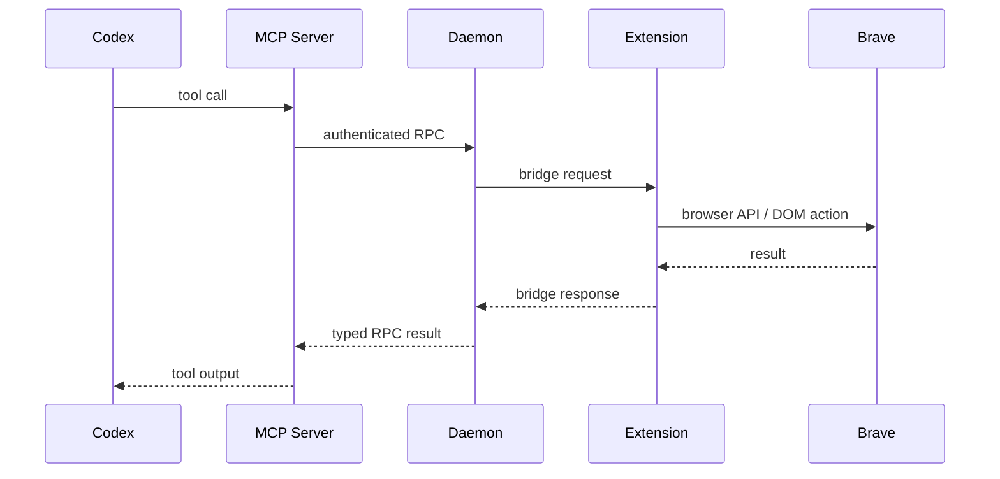

# Architecture

`brave-mcp` is built as a local three-process control stack.

## High-Level Flow

## Components

### `apps/extension`

Responsibilities:

- maintain the WebSocket bridge to the daemon
- call Brave extension APIs such as `tabs`, `windows`, `scripting`, `downloads`, `cookies`, and `debugger`
- execute DOM operations in page context
- expose the options UI for daemon URL, auth token, and bridge status

Why it exists:

- only the extension can safely and directly interact with the browser runtime
- keeping this layer thin avoids leaking browser-specific details into the MCP server

### `apps/daemon`

Responsibilities:

- bind to `127.0.0.1` only
- generate and persist the shared auth secret
- accept and monitor extension bridge connections
- expose health endpoints and RPC endpoints
- manage timeouts, request IDs, and browser-session state

Why it exists:

- Codex needs a stable local endpoint
- browser transport details should not be baked into the MCP transport layer
- localhost is easier to observe, debug, and package than native messaging for an initial public release

### `apps/mcp`

Responsibilities:

- define the MCP tools exposed to Codex
- validate input with shared protocol schemas
- normalize daemon errors into a predictable tool surface
- expose the tool catalog over MCP `stdio`

Why it exists:

- Codex wants a standard MCP server, not extension-specific behavior
- this layer keeps the tool contract stable even if daemon internals evolve

## Trust And Security Boundaries

- Codex talks only to the MCP server.
- The MCP server talks only to the local daemon.
- The daemon accepts requests only with the shared secret.
- The extension connects only to the daemon URL the user configured.
- The daemon binds to loopback and is not intended for network exposure.

## Transport Choices

Current transports:

- Codex -> MCP: `stdio`
- MCP -> daemon: localhost HTTP
- daemon -> extension: localhost WebSocket

These were chosen because they are easy to inspect, test, and package during early iterations.

## Tool Lifecycle Rule

A tool is considered implemented only when all of these exist:

- protocol schema
- daemon RPC method
- extension runtime behavior
- MCP tool exposure

And a tool should be verified either with:

- the simulated bridge path
- a real Brave smoke test
